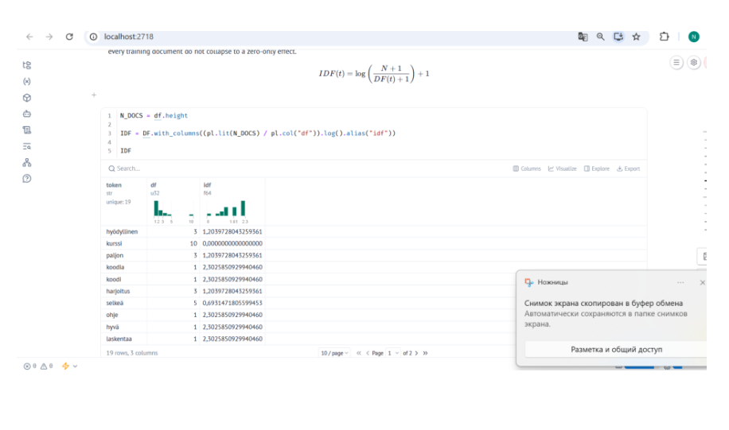
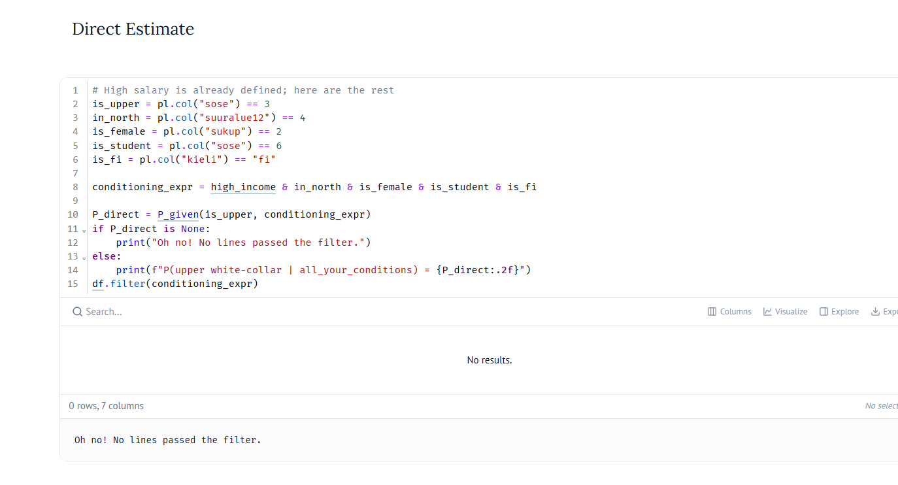
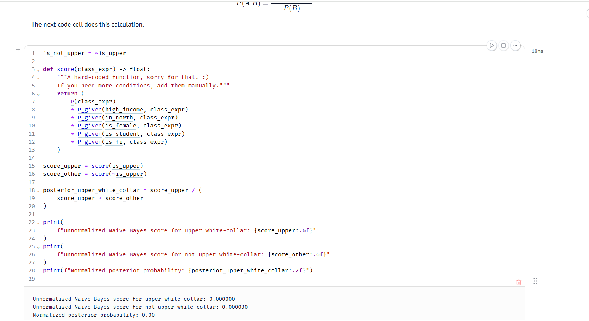
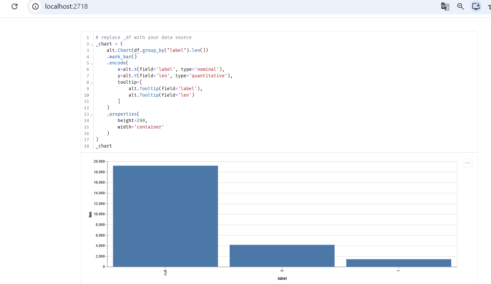
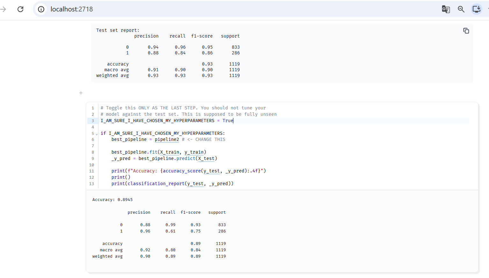

# 39: Tekstin enkoodaus ja Naive Bayes

Tällä viikolla tutustuin kahteen aiheeseen: miten teksti muutetaan numeroiksi (TF-IDF) ja miten Bayesin kaava toimii käytännössä, kun aineistossa on useita ehtoja.
---
## 1. Tekstin muuttaminen numeroiksi ja TF-IDF
Tietokone ei ymmärrä sanoja suoraan. Siksi teksti pitää muuttaa numeroiksi. Jos lasketaan vain sanojen määrä (TF), tavalliset sanat saavat liikaa painoa. Tämän takia käytetään IDF-arvoa. Se pienentää sellaisten sanojen painoarvoa, jotka toistuvat melkein jokaisessa tekstissä.

Tehtävässä lisäsin sanan `kurssi` kaikkiin 10 dokumenttiin ($DF = 10, N = 10$). Kaava laskee sen näin:

$$\log(10 / 10) = \log(1) = 0.0$$

Koska tulos on 0.0, sanan paino nollautui kokonaan. Tämä näyttää käytännössä sen, että jos sana löytyy joka paikasta, se ei auta mallia erottelemaan tekstejä toisistaan.

---
## 2. Tilastot ja Bayes: Suora haku vs. Naive Bayes

Käytin harjoituksessa Tilastokeskuksen dataa. Tavoitteena oli laskea todennäköisyys sille, että henkilö on ylempi toimihenkilö (`sose == 3`).

### Suora laskenta (Direct Estimate)
Yritin ensin suodattaa dataa suoraan näillä ehdoilla:
* tulot yli 70 000 €
* asuinpaikka Pohjois-Suomi
* nainen
* opiskelija (`sose == 6`)
* kieli suomi (`kieli == "fi"`)

Tulokseksi tuli 0 riviä (*Oh no! No lines passed the filter*). Aineisto oli liian pieni näin tarkalle yhdistelmälle. Siksi suora suodatus ei toiminut ollenkaan.

### Naive Bayes
Naive Bayes ratkaisee tämän ongelman. Se laskee jokaisen ehdon todennäköisyyden erikseen ja kertoo ne yhteen. Silloin datasta ei tarvitse löytyä valmista riviä, jossa kaikki ehdot toteutuvat samalla kertaa.

Kun lisäsin uudet ehdot koodiin, laskenta meni läpi ilman virheitä.

Lopullinen todennäköisyys oli **0.00**. Tulos on järkevä, koska opiskelija harvoin tienaa yli 70 000 euroa ja toimii samaan aikaan ylempänä toimihenkilönä. Pääasia kuitenkin oli, että malli pystyi laskemaan todennäköisyyden ilman nollalla jakamista.

## 3. Vihapuheen tunnistaminen (Naive Bayes)

Harjoituksen kolmannessa osassa tein mallin, joka tunnistaa vihapuhetta Twitter-viesteistä. Käytin mallina Multinomial Naive Bayes -menetelmää. Aineistona oli valmis tiedosto `labeled_data.csv`.

### Datan tarkastelu ja luokkien epätasapaino

Tehtävänä oli tehdä binäärinen luokittelu. Viesti on joko vihapuhetta (1) tai se ei ole vihapuhetta (0). Neutraaleja tai pelkästään loukkaavia viestejä en ottanut mukaan analyysiin.

Kuten kuvaajasta näkyy, tavallisia viestejä (luokka 0) on paljon enemmän kuin vihapuhetta (luokka 1). Luokat ovat siis epätasapainossa. Tämän takia pelkkä kokonaistarkkuus (accuracy) ei riitä, vaan pitää katsoa myös F1-tulosta ja saantia (recall).

### Datan siivous ja mallin opetus

Ennen mallin opettamista siivosin twiiteistä turhat asiat pois. Poistin linkit, käyttäjänimet (@-merkit) ja välimerkit.

Kokeilin harjoituksessa kahta eri versiota:
* **Perusmalli:** sanat laskettiin yksitellen (unigrammit).
* **Parannettu malli:** otin mukaan myös sanaparit (bigrammit, `ngram_range=(1, 2)`). Sanaparit auttavat mallia huomaamaan paremmin sanojen yhteyksiä.

### Testitulokset

Lopuksi testasin valmista mallia erillisellä testidatalla, jota se ei ollut nähnyt aiemmin:

* **Kokonaistarkkuus (Accuracy):** noin **89.5 %** (0.8945).
* **Tarkkuus vihapuheelle (Precision):** **0.96**. Kun malli väittää viestiä vihapuheeksi, se osuu melkein aina oikeaan. Vääriä hälytyksiä tulee tosi vähän.
* **Saanti vihapuheelle (Recall):** **0.61**. Malli löytää noin 61 % kaikesta vihapuheesta. Osa vihapuheesta jää siis huomaamatta luokkien epätasapainon takia.