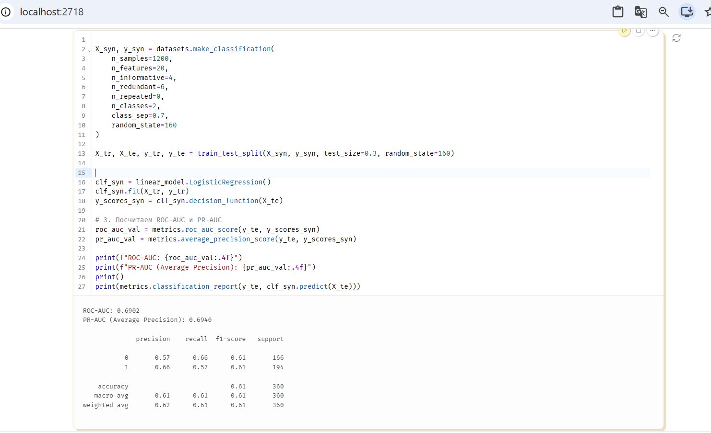

# 40: Puut, metsät ja luokittelun suorituskyky

Tällä viikolla aiheena oli luokittelumallien arviointi (metriikat) sekä päätöspuut ja satunnaismetsät.

## 1. Luokittelun suorituskyky ja metriikat

Ensimmäisessä tehtävässä tutkin, miten luokittelumallin toimintaa arvioidaan käytännössä. Pelkkä tarkkuus (accuracy) ei riitä, jos aineistossa luokat ovat epätasapainossa.

Tehtävässä kokeilin tuttuja mittareita:
* **Confusion matrix (Sekaannusmatriisi):** näyttää oikeat ja väärät ennusteet taulukkona.
* **Recall (Saanti):** kertoo, kuinka suuren osan oikeista tapauksista malli löysi.
* **Precision (Täsmällisyys):** kertoo, kuinka moni mallin ennustamista positiivisista tapauksista oli oikeasti oikein.
* **ROC-AUC:** näyttää, miten hyvin malli erottaa luokat toisistaan eri kynnysarvoilla.

### Extra Challenge

MNIST-tehtävässä numeron 3 tunnistaminen oli mallille liian helppoa. Tulokset olivat melkein 100 %. Siksi tein tiedoston lopussa olevan lisätehtävän (Extra Challenge).

Tein koodilla vaikeamman synteettisen aineiston (`make_classification`), johon lisäsin kohinaa. Opetin siihen mallin ja tarkistin tulokset:

Tulokset haastavammalla aineistolla:
* **Accuracy:** 0.61 (noin 61 % meni oikein)
* **ROC-AUC:** 0.6902
* **PR-AUC:** 0.6940

Tulos osoittaa selvästi sen, että kohinan takia malli tekee enemmän virheitä eikä pysty ennustamaan kaikkea oikein.
