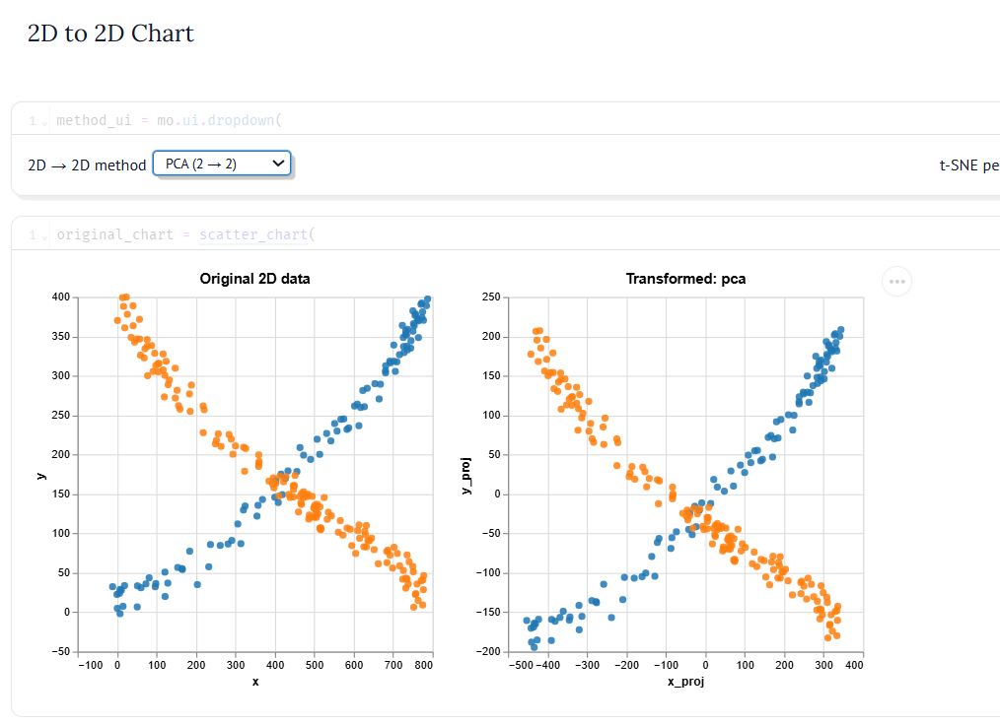
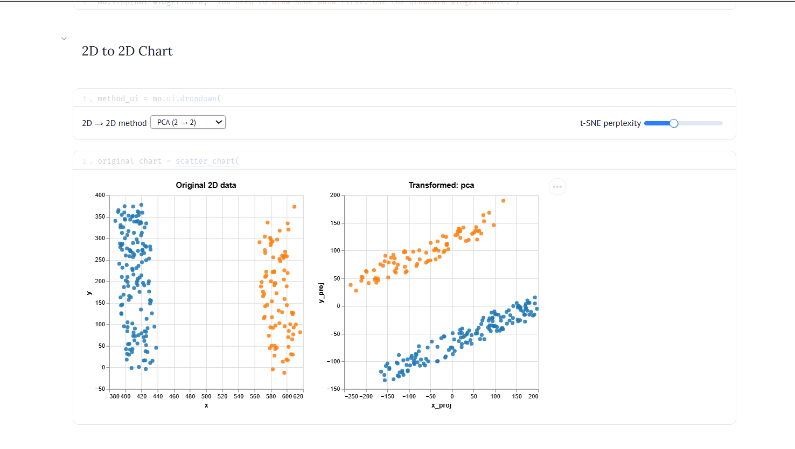
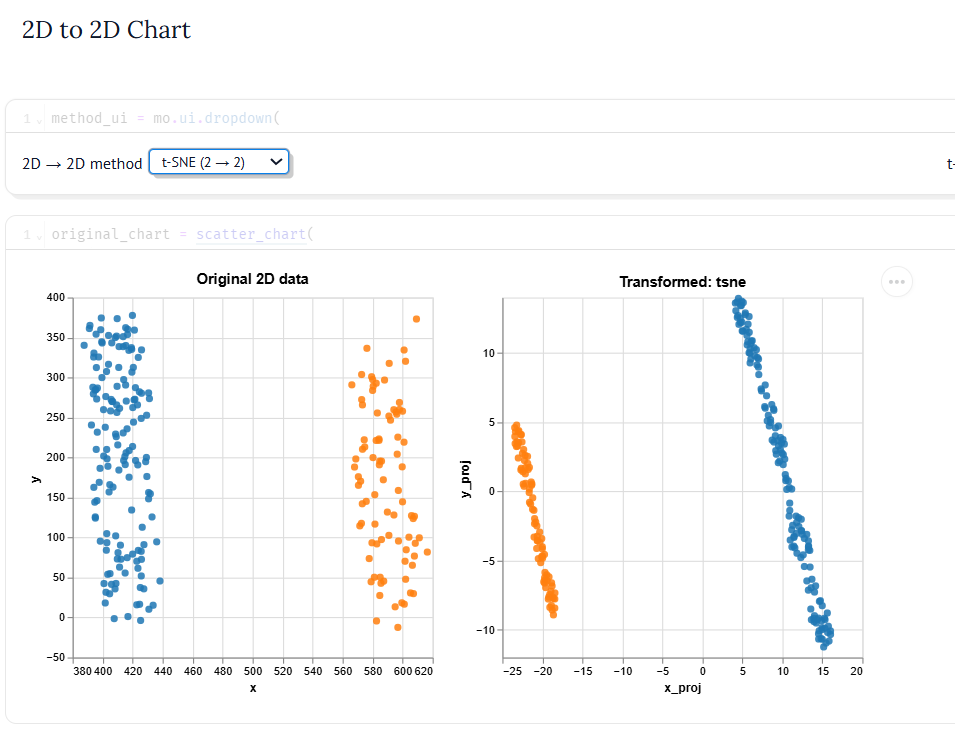
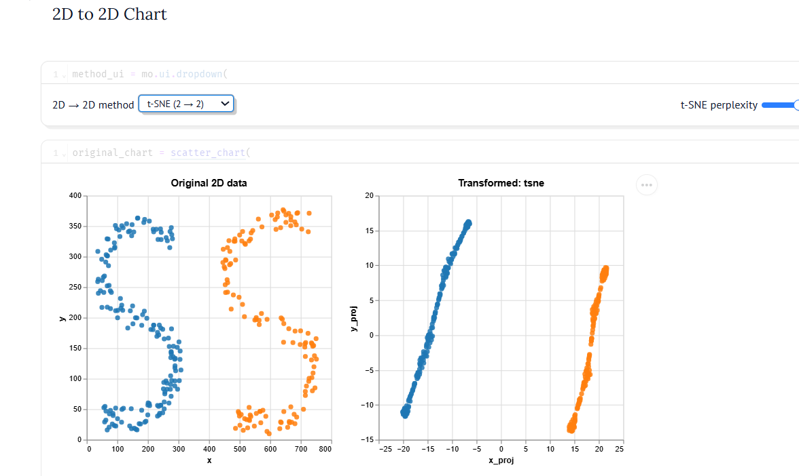
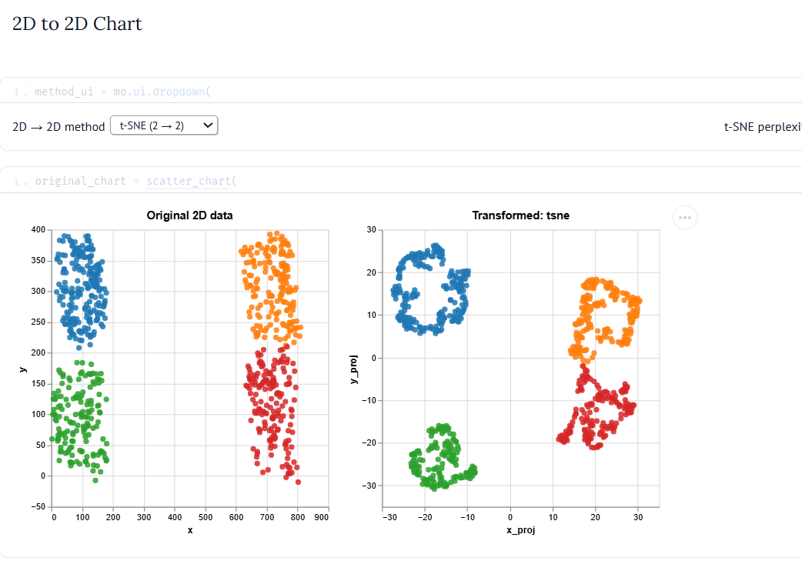
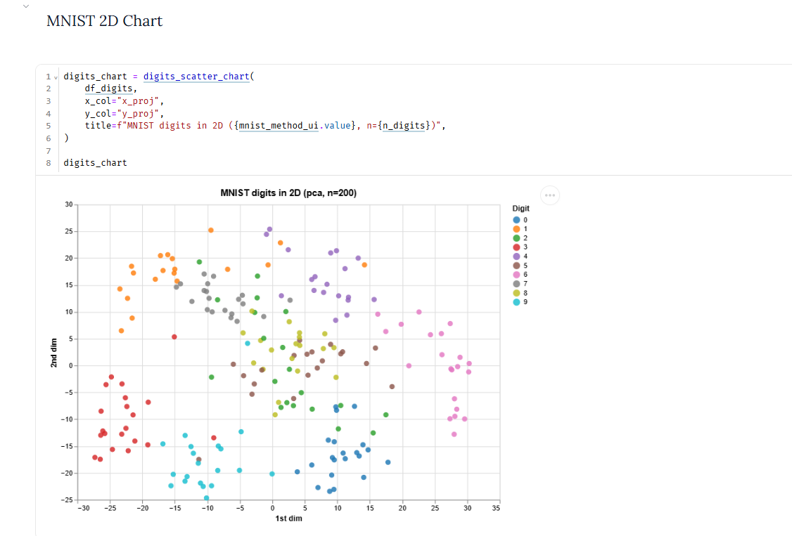
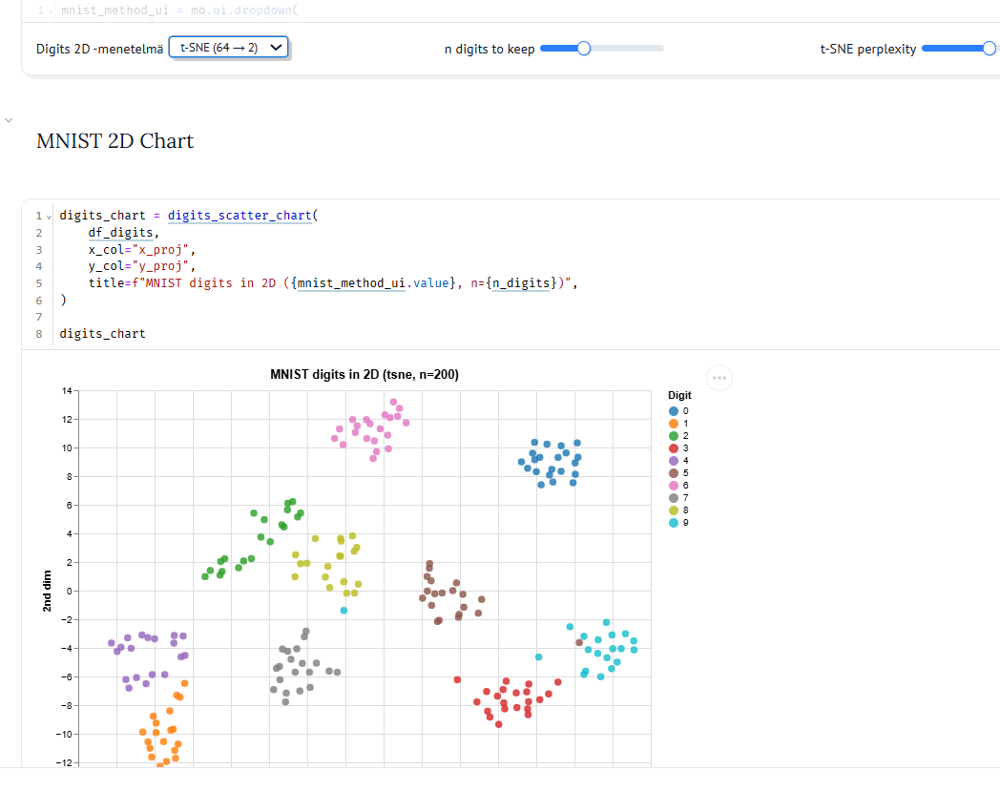

# Viikko 41: Piirteiden skaalaus, dimensiovähennys ja k-NN

Tällä viikolla perehdyin kolmeen keskeiseen teemaan: piirteiden skaalaukseen, dimensiovähennykseen (PCA, MDS, t-SNE) sekä k-NN-luokittelijan toteutukseen alusta alkaen.

## Viikko 41: Dimensiovähennys (PCA ja t-SNE)

Tällä viikolla perehdyin moniulotteisen datan tiivistämiseen ja visualisointiin kahdella keskeisellä menetelmällä: lineaarisella pääkomponenttianalyysillä (PCA) sekä epälineaarisella t-SNE-menetelmällä. Kokeilin menetelmien toimintaa ensin synteettisellä 2D-datalla (`Drawdata`-kirjaston avulla) ja sen jälkeen korkeaulotteisella MNIST-numerodatalla.

---

## 1. Menetelmien perusperiaatteet

- **PCA (Principal Component Analysis):** Lineaarinen dimensiovähennysmenetelmä, joka projisoi datan uusille ortogonaalisille akseleille (pääkomponenteille) siten, että datan varianssi maksimoituu. PCA säilyttää datan globaalin lineaarisen geometrian ja kokonaishajonnan, mutta se ei kykene mallintamaan epälineaarisia rakenteita.
- **t-SNE (t-Distributed Stochastic Neighbor Embedding):** Epälineaarinen menetelmä, joka mallintaa datapisteiden naapuruussuhteita todennäköisyyksinä sekä korkea- että matalaulotteisessa avaruudessa. Menetelmä soveltuu erinomaisesti paikallisten ryhmien, monimuotoisten klustereiden ja datan sisäisen topologian esiin tuomiseen.

---

## 2. Kokeet synteettisillä muodoilla (Drawdata)

Interaktiivisella `ScatterWidget`-työkalulla generoitiin erilaisia geometrisia 2D-pistekuvioita menetelmien käyttäytymisen vertailemiseksi:

### Risti / Leikkaavat viivat (X-muoto)
PCA keskittää pistejoukon nollan ympärille ja kiertää koordinaatiston suurimman varianssin suuntaisesti. Koska menetelmä on täysin lineaarinen, ristin leikkauskohdassa eri luokkien pisteet sekoittuvat toisiinsa — PCA ei kykene erottelemaan toisiaan leikkaavia haaroja toisistaan matalammassa ulottuvuudessa.

---

### Rinnakkaiset viivat (II-muoto)
Kokeessa piirrettiin kaksi erillistä pystysuoraa rinnakkaista viivaa eri luokille:
- **PCA:** Kääntää koordinaatiston ja säilyttää viivojen välisen suhteellisen etäisyyden sekä suoraviivaisen geometrian.
- **t-SNE:** Tiivistää kummankin viivan pisteet omiksi erillisiksi nauhoikseen, jolloin luokkien välinen raja säilyy erittäin selkeänä paikallisten etäisyyksien ansiosta.

| PCA (II-muoto) | t-SNE (II-muoto) |
| :---: | :---: |
|  |  |

---

### S-kirjain (Epälineaarinen käyrä)
Tämä koe havainnollistaa selkeimmin t-SNE:n ja lineaaristen menetelmien välisen eron:
- t-SNE "oikaisee" mutkittelevat S-käyrät lähes suoriksi säikeiksi, koska algoritmi optimoi pisteiden paikallista järjestystä ja naapuruutta eikä pakota dataa globaalisti suorille akseleille.

---

### Windows-logo (Neljä erillistä klusteria)
Neljä toisistaan selkeästi erillään olevaa pisteklusteria säilyttävät muotonsa ja erottuvat luotettavasti molemmilla menetelmillä:
- PCA säilyttää ryhmien globaalit keskinäiset suhteet.
- t-SNE vetää klusterit vieläkin tiiviimmiksi ja toisistaan eristetyiksi saarekkeiksi.

---

## 3. MNIST-numerot (64 ulottuvuudesta kahteen)

Lopuksi menetelmiä testattiin korkeaulotteisella `load_digits`-kuva-aineistolla, jossa jokainen numero koostuu 64 pikselin harmaasävyarvosta ($8 \times 8$ -matriisi):

- **PCA (64 → 2):** Ryhmittelee numeroita karkeasti yleisen pikselijakauman mukaan, mutta useiden numeroluokkien pisteet menevät huomattavan paljon päällekkäin lineaarisen projektion rajoitteiden vuoksi.
- **t-SNE (64 → 2):** Jakaa numeroluokat (0–9) hämmästyttävän selkeiksi, toisistaan eristetyiksi saarekkeiksi täysin ilman ennakkotietoa todellisista luokkatiedoista projektiohetkellä.

| MNIST PCA (64 → 2) | MNIST t-SNE (64 → 2) |
| :---: | :---: |
|  |  |